# Registering Services

#The two microservices are running and registered
Vista de los dos servicios corriendo
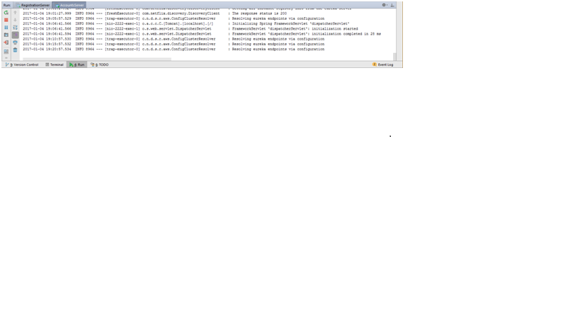

Vista desde Account
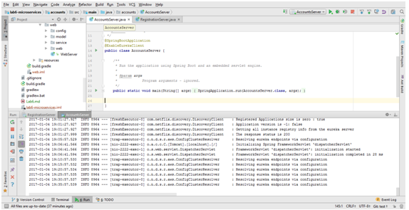

Vista desde el Server
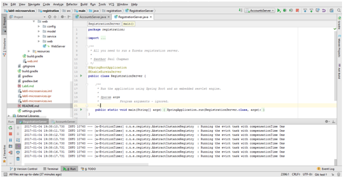

La vista desde la interfaz grafica
La del servidor Eureka, la del puerto 1111 
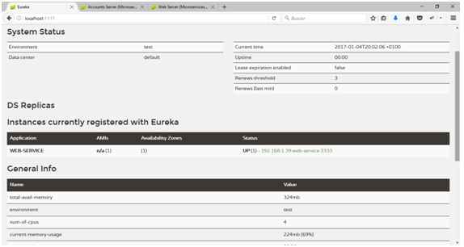

Y la del puerto 2222, la de accounts
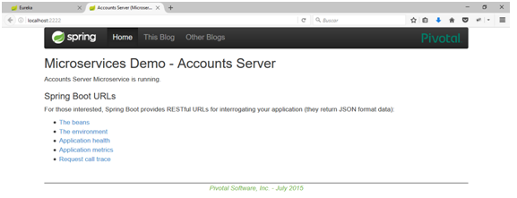

Aquí se aprecian los tres servicios 
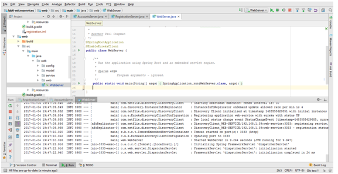

Y aquí se ve la web
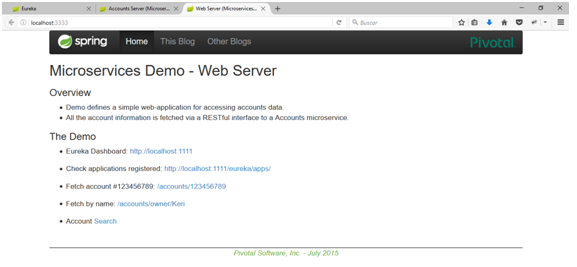

#The service registration service has the two microservices registered 
Aquí se pueden ver dos servicios, el Accounts-service y Web-service
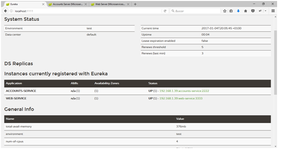

#A second account microservice is running in the port 4444 and it is registered 
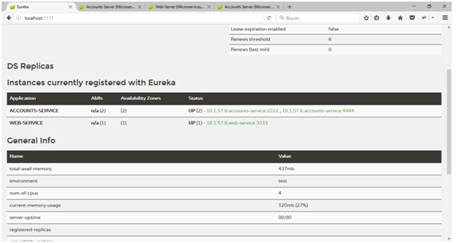
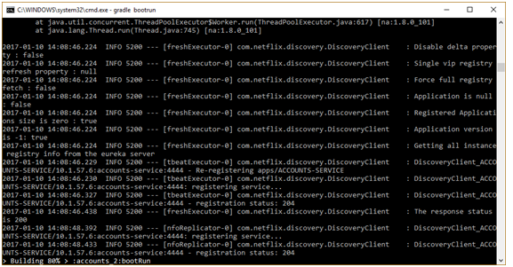

#A brief report describing what happens when you kill the microservice with port 2222. Can the web service provide information about the accounts? Why?
Se elimina el Account del puerto 2222
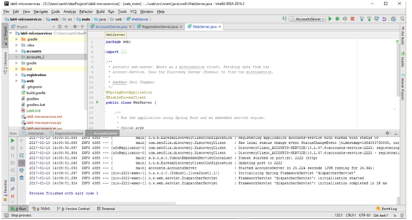
Al ser eliminado se ve como se ha perdido la conexion
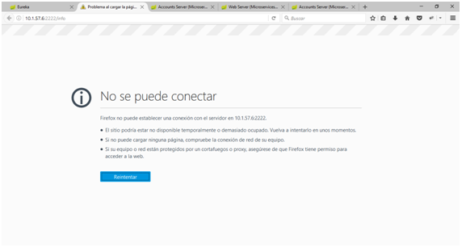
Se ve como el Account del puerto 4444 sigue vivo
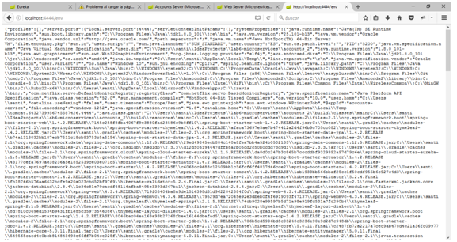

Lo que realmente ha pasado es que ha realizado un reemplazo de Account en caliente.

Te añado un pdf en la carpeta /imagenes donde estan las capturas.